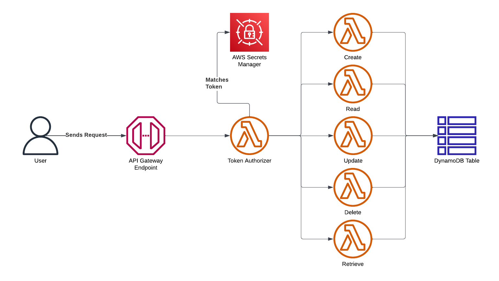
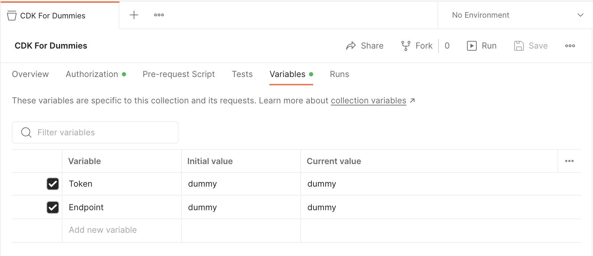

# CDK For Dummies



## Introduction

Imagine you are a Cloud Architect and your business needs an API for a microservice.  This is a common pattern to solving many problems.

There are many steps to setting an API up "Production-ready".  That's where this repository comes in.  API Gateway makes it easy to deploy an Edge-optimized endpoint quickly, and with a few tweaks to add an Authorizer and some additional permissions, we can have a fully-fledged API Deployment in minutes.

There is also a CI/CD Pipeline using GitHub Actions for automated testing, building and deployment.

*To learn more about each individual service used in the Stack, look at the source code and the CDK API Reference.*

## Pre-Requisites

To test and build locally, you will need to install [Node](https://nodejs.org/en).

Once you install Node, you will need to install the [CDK CLI](https://docs.aws.amazon.com/cdk/v2/guide/cli.html).

```npm i -g aws-cdk```

When you have permissions to your AWS environment, you are ready to deploy the application.  If you don't have permissions setup, here are some methods I recommend.

### GitHub Actions

I included a GitHub Actions pipeline in the repository, which will automate the test, build and deploy stages for you.  All you need to do is [configure AWS credentials](https://github.com/aws-actions/configure-aws-credentials) with sufficient permissions to it.

The recommended setup for this is to use an [OpenID Connect (OIDC) Provider](https://docs.github.com/en/actions/deployment/security-hardening-your-deployments/configuring-openid-connect-in-amazon-web-services).  I have another [CDK repository](https://github.com/kamosh-in/github-oidc) to automatically setup the OIDC Provider and a role which uses the provider in its trust policy.

*This might present a dillema, where you want to setup permissions for Actions in order to deploy CDK Apps, but the template to setup the identity is CDK itself and needs permissions to deploy.  In this case, manually deploy the OIDC stack first with one of the next options.*

### AWS IAM Identity Center

Formerly known as AWS Single Sign-On, this service [grants command line or programmatic access](https://docs.aws.amazon.com/cli/latest/userguide/sso-configure-profile-token.html#sso-configure-profile-token-auto-sso).

A prerequisite to using this method is the [AWS CLI](https://docs.aws.amazon.com/cli/index.html).

### AWSume

If you have a classic IAM user or role, you can use [AWSume](https://awsu.me) to easily get command line access.

### CDK Synth

If you want to deploy with the AWS Console, then run 

```cdk synth```

to synthesize a CloudFormation template from the app.  You can then take this template to [CloudFormation](https://docs.aws.amazon.com/cloudformation/index.html) and deploy it.

## Deployment

If you did not use GitHub Actions to deploy the application, manually deploy by running the testing suite and then using the CDK CLI.

```npm t```

```cdk deploy```

### Usage

To use the app, look at the CloudFormation Outputs from the terminal.  You will find the "ApiEndpoint" and the "ApiAuthorizerTokenName".  The Endpoint is the URL you will send API requests to, but you will first need the Authorization Token.  To retrieve that from Secrets Manager, use the AWS CLI.

```aws secretsmanager get-secret-value --secret-id <ApiAuthorizerTokenName> --query SecretString```

*This command will also require permissions to your AWS environment.  It should work right after you deploy.  If you used GitHub Actions and don't want to setup command line access, use the AWS Console and find the Secret on Secrets Manager.*

The Token Secret String (without the quotation marks) will go in the "Authorization" header of the request.  I recommend [Postman](https://www.postman.com/product/what-is-postman/) to test with.  I have included my Collection in the repository to import into Postman and easily get working with properly-formatted requests.

Once you have imported the Collection, go to the Variables tab and replace the dummy values with your Endpoint and Token.



*Make sure that you include the forward slash '/' at the end of the Endpoint variable.*

Now, you can go through each method and test to make sure you can create, read, and modify Items on the Table.

### Cleanup

Once you are ready, destroy the application if you don't want to keep it.

``` cdk destroy```
